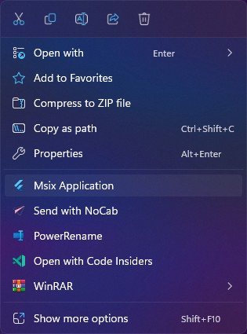
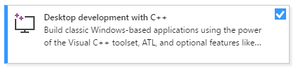
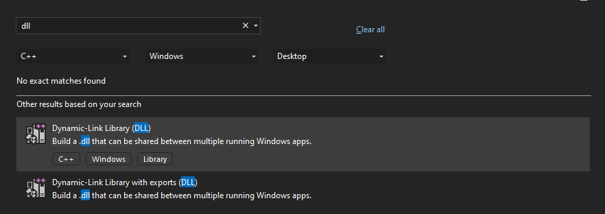
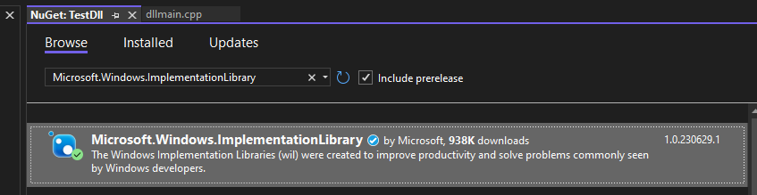
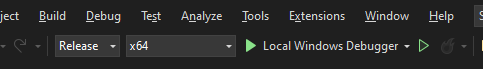

## Context Menu configuration

##### Context Menu configuration example:

```yaml
msix_config:
  display_name: Flutter App
  context_menu: # <-- Context Menu configuration
    dll_path: path/to/your/context_menu.dll # required
    items:
      - type: "*" # <-- * means all files
        commands:
          - id: Command1
            clsid: replace-with-your-guid-CDB3EAED7496
            custom_dll: path/to/your/custom/dll.dll # optional
      - type: Directory # <-- Directory means folders
        commands:
          - id: Command1
            clsid: replace-with-your-guid-CDB3EAED7496
      - type: Directory\Background # <-- Directory\Background means background
        commands:
          - id: Command1
            clsid: replace-with-your-guid-CDB3EAED7496
      - type: .txt # <-- .txt means only .txt files
        commands:
          - id: Command1
            clsid: replace-with-your-guid-CDB3EAED7496
          - id: Command2 
            clsid: replace-with-your-guid-CDB3EAED4497
          - id: Command3
            clsid: replace-with-your-guid-CDB3EAED8498
                    
  msix_version: 1.0.3.0
```
## Structure

```yaml	
msix_config:
  context_menu:
    dll_path: path/to/your/context_menu.dll # required
    items: # required
      ...
```

| YAML name  | Command-line argument | Description                                           | Example                                           |
| ---------- | --------------------- | ----------------------------------------------------- | ------------------------------------------------- |
| `dll_path` | N/A                   | Path of your context menu dll                         | `C:\Users\user\Desktop\Projects\ContextMenu.dll`  |
| `items`    | N/A                   | List of context menu item                             |                                                   |

> [!NOTE]\
> **Configuring context menu with command line arguments not supported. So if you don't want to include context menu in to your msix package, you can use `skip-context-menu` argument. This will skip context menu configuration. Can be helpful in CI.**

### Item structure

| YAML name  | Command-line argument | Description                   | Example                                                 |
| ---------- | --------------------- | ----------------------------- | ------------------------------------------------------- |
| `type`     | N/A                   | Type of the context menu item | `*`, `Directory`, `Directory\Background`, `.txt`, `...` |
| `commands` | N/A                   | List of commands              |                                                         |


```yaml
- type: "*" # <-- * means all files
  commands:
    ...
```

> [!IMPORTANT]\
> If you want to use `*` as a type, you need to put it into double quotes (`"*"`). Otherwise, yaml parser doesn't understand it as a string.


### Command structure

| YAML name    | Command-line argument | Description                                                                   | Example                                            |
| ------------ | --------------------- | ----------------------------------------------------------------------------- | -------------------------------------------------- |
| `id`         | N/A                   | Id of the command. You need to grab this from your dll source code.           | `Command1`                                         |
| `clsid`      | N/A                   | Clsid of the command. You need to grab this from your dll source code.        | `a45623df-ac7b-40e6-a230-73d937322b97`             |
| `custom_dll` | N/A                   | Path of the custom dll. You need to pass this if you want to use a custom dll | `C:\Users\user\Desktop\Projects\ContextMenu2.dll` |

```yaml	
- id: Command1 # required (Grab this from your dll source code)
  clsid: replace-with-your-guid-CDB3EAED7496 # required (Grab this from your dll source code)
  custom_dll: path/to/your/custom/dll.dll # optional (pass if you want to use a custom dll for this command)
```

### Understanding the general structure

```yaml
msix_config:
  context_menu:
    dll_path: path/to/your/context_menu.dll # required
    items:
                                                                    ┐
      - type: "*"                                                   │ 
        commands:                                                   │    
                                                        ┐           │ Item
          - id: Command4                                │ Command   │ One
            clsid: replace-with-your-guid-CDB3EAED7499  │ One       │
            custom_dll: path/to/your/custom/dll.dll     │           │
                                                        ┘           │
                                                                    ┘
                                                                    ┐
      - type: Directory                                             │  
        commands:                                                   │    
                                                        ┐           │ Item
          - id: Command1                                │ Command   │ Two
            clsid: replace-with-your-guid-CDB3EAED7496  │ One       │
                                                        ┘           │
                                                                    ┘
                                                                    ┐
      - type: Directory\Background                                  │
        commands:                                                   │
                                                        ┐           │ Item 
          - id: Command1                                │ Command   │ Three
            clsid: replace-with-your-guid-CDB3EAED7496  │ One       │
                                                        ┘           │
                                                                    ┘ 
                                                                    ┐
      - type: .txt                                                  │
        commands:                                                   │
                                                        ┐           │
          - id: Command1                                │ Command   │
            clsid: replace-with-your-guid-CDB3EAED7496  │ One       │
                                                        ┘           │
                                                        ┐           │ Item
          - id: Command2                                │ Command   │ Four
            clsid: replace-with-your-guid-CDB3EAED4497  │ Two       │
                                                        ┘           │
                                                        ┐           │
          - id: Command3                                │ Command   │
            clsid: replace-with-your-guid-CDB3EAED8498  │ Three     │
                                                        ┘           │
                                                                    ┘
```

> [!NOTE]\
> You can add as many items as you want. You can also add as many commands as you want to one item. But you can't add same command inside one item. And you can't add same item type more than once. If you do, you will get an error.

<br>

## How to create a basic context menu dll



### 0. Introduction

In this guide we will create a basic context menu dll that will open our flutter application with selected file/folder paths as arguments.

**This guide will assume you to have basic knowledge about C++, Visual Studio and Context menus.**
 
Also, you will very likely to see some errors while you are trying to build your dll. You need to use your developer skills to solve them. 

> [!IMPORTANT]\
> This guide currently doesn't written by who expert on C++ or Windows. Due to very limited information about windows context menus, I felt responsible to write it. If you see any mistake or something that can be improved, don't hesitate to create a pull request.

### 1. Install Visual Studio with `Desktop development with C++` workload.

Make sure you installed `Visual Studio` with the `Desktop development with C++` workload.



### 2. Create a new project

Open Visual Studio and create `Dynamic-Link Library (DLL)` project.
You can name it whatever you want.



### 3. Install `Microsoft.Windows.ImplementationLibrary` package.

Under `Project` tab, click `Manage NuGet Packages...` click `browse` and install `Microsoft.Windows.ImplementationLibrary` package.



### 4. Dllmain.cpp

Turn back to `dllmain.cpp` and replace its content with the following code. And make changes that I mentioned on the code.

> [!NOTE]\
> You can generate guid under `Tools` tab and click `Create GUID` and click `Copy` and paste it to your code.

<details>
<summary>Code</summary>
<br>

```cpp
#include "pch.h"
#include <atlfile.h>
#include <atlstr.h>
#include <shobjidl_core.h>
#include <string>
#include <filesystem>
#include <sstream>
#include <Shlwapi.h>
#include <vector>
#include <wil\resource.h>
#include <wil\win32_helpers.h>
#include <wil\stl.h>
#include <wrl/module.h>
#include <wrl/implements.h>
#include <wrl/client.h>
#include <mutex>
#include <thread>
#include <shellapi.h>

using namespace Microsoft::WRL;

HINSTANCE g_hInst = 0;

BOOL APIENTRY DllMain(HMODULE hModule,
    DWORD  ul_reason_for_call,
    LPVOID lpReserved
)
{
    switch (ul_reason_for_call)
    {
    case DLL_PROCESS_ATTACH:
        g_hInst = hModule;
        break;
    case DLL_THREAD_ATTACH:
    case DLL_THREAD_DETACH:
    case DLL_PROCESS_DETACH:
        break;
    }
    return TRUE;
}

// This function is for to get out flutter application folder. It also comes from microsoft.
// https://github.com/microsoft/PowerToys/blob/3443c73d0e81a958974368763631035f3e510653/src/common/utils/process_path.h
inline std::wstring get_module_folderpath(HMODULE mod = nullptr, const bool removeFilename = true)
{
    wchar_t buffer[MAX_PATH + 1];
    DWORD actual_length = GetModuleFileNameW(mod, buffer, MAX_PATH);
    if (GetLastError() == ERROR_INSUFFICIENT_BUFFER)
    {
        const DWORD long_path_length = 0xFFFF; // should be always enough
        std::wstring long_filename(long_path_length, L'\0');
        actual_length = GetModuleFileNameW(mod, (LPWSTR)long_filename.data(), long_path_length);
        PathRemoveFileSpecW((LPWSTR)long_filename.data());
        long_filename.resize(std::wcslen(long_filename.data()));
        long_filename.shrink_to_fit();
        return long_filename;
    }

    if (removeFilename)
    {
        PathRemoveFileSpecW(buffer);
    }
    return { buffer, (UINT)lstrlenW(buffer) };
}
//                     ᐯ  This is the "clsid" you need to pass into your context_menu command configuration. YOU NEED TO CHANGE UUID WITH YOURS. GENERATE A NEW ONE.
class __declspec(uuid("change-that-withyour-uniqueguid")) YourAppMenuCommand final : public RuntimeClass<RuntimeClassFlags<ClassicCom>, IExplorerCommand, IObjectWithSite>
{ //                                                      ᐱ This is the "id" you need to pass into your context menu command configuration
public:
    //                                        ᐯ Change that line with what do you want to show on context menu
    virtual const wchar_t* Title() { return L"Context Menu Item Text"; };
    virtual const EXPCMDFLAGS Flags() { return ECF_DEFAULT; }
    virtual const EXPCMDSTATE State(_In_opt_ IShellItemArray* selection) { return ECS_ENABLED; }

    IFACEMETHODIMP GetTitle(_In_opt_ IShellItemArray* items, _Outptr_result_nullonfailure_ PWSTR* name)
    {
        *name = nullptr;
        //                 ᐯ Change that line with what do you want to show on context menu
        return SHStrDupW(L"Context Menu Item Text", name);
    }
    IFACEMETHODIMP GetIcon(_In_opt_ IShellItemArray*, _Outptr_result_nullonfailure_ PWSTR* icon)
    {
        std::wstring iconResourcePath = get_module_folderpath(g_hInst);
        // this is what icon will shown on context menu. Add your ico file on your assets (on flutter side) and dont forget adding it to the pubspec file
        // '\data\flutter_assets' is the exact location where flutter put your assets for your application.
        //                    ᐯ also dont forget to change icon name
        iconResourcePath += L"\\data\\flutter_assets\\assets\\your_context_menu_icon.ico";  
        return SHStrDup(iconResourcePath.c_str(), icon);
    }
    IFACEMETHODIMP GetToolTip(_In_opt_ IShellItemArray*, _Outptr_result_nullonfailure_ PWSTR* infoTip) { *infoTip = nullptr; return E_NOTIMPL; }
    IFACEMETHODIMP GetCanonicalName(_Out_ GUID* guidCommandName) { *guidCommandName = GUID_NULL;  return S_OK; }
    IFACEMETHODIMP GetState(_In_opt_ IShellItemArray* selection, _In_ BOOL okToBeSlow, _Out_ EXPCMDSTATE* cmdState)
    {
        if (nullptr == selection) {
            *cmdState = ECS_HIDDEN;
            return S_OK;
        }

        *cmdState = ECS_ENABLED;
        return S_OK;
    }
    // This is the function will be called when user clicked to the item
    // What we basically do here is just getting file/directory paths where/what user selected and send them to our flutter application (with arguments)
    // So as you can imagine this will open another instance of your app. If you don't want that search for what ipc is.
    IFACEMETHODIMP Invoke(_In_opt_ IShellItemArray* selection, _In_opt_ IBindCtx*) noexcept try
    {
        HWND parent = nullptr;
        if (m_site)
        {
            ComPtr<IOleWindow> oleWindow;
            RETURN_IF_FAILED(m_site.As(&oleWindow));
            RETURN_IF_FAILED(oleWindow->GetWindow(&parent));
        }

        std::wostringstream itemPaths;

        if (selection)
        {
            DWORD count = 0;
            selection->GetCount(&count);

            for (DWORD i = 0; i < count; i++)
            {
                IShellItem* shellItem;
                selection->GetItemAt(i, &shellItem);
                LPWSTR itemName;
                // Retrieves the entire file system path of the file from its shell item
                shellItem->GetDisplayName(SIGDN_FILESYSPATH, &itemName);
                CString fileName(itemName);
                itemPaths << L"\"" << std::wstring(fileName) << L"\"" << L" ";
            }

            std::wstring executablePath = get_module_folderpath(g_hInst);
            //                    ᐯ YOU NEED TO CHANGE THIS NAME WITH YOUR APPLICATION
            executablePath += L"\\your_application.exe";
            ShellExecute(NULL, L"open", executablePath.c_str(), itemPaths.str().c_str(), get_module_folderpath(g_hInst).c_str(), SW_SHOWDEFAULT);
        }


        return S_OK;
    }
    CATCH_RETURN();

    IFACEMETHODIMP GetFlags(_Out_ EXPCMDFLAGS* flags) { *flags = Flags(); return S_OK; }
    IFACEMETHODIMP EnumSubCommands(_COM_Outptr_ IEnumExplorerCommand** enumCommands) { *enumCommands = nullptr; return E_NOTIMPL; }

    IFACEMETHODIMP SetSite(_In_ IUnknown* site) noexcept { m_site = site; return S_OK; }
    IFACEMETHODIMP GetSite(_In_ REFIID riid, _COM_Outptr_ void** site) noexcept { return m_site.CopyTo(riid, site); }

protected:
    ComPtr<IUnknown> m_site;
};

//               ᐯ If you change the class name you need to change this line too.
CoCreatableClass(YourAppMenuCommand)
//                                   ᐯ And this
CoCreatableClassWrlCreatorMapInclude(YourAppMenuCommand)

STDAPI DllGetActivationFactory(_In_ HSTRING activatableClassId, _COM_Outptr_ IActivationFactory** factory)
{
    return Module<ModuleType::InProc>::GetModule().GetActivationFactory(activatableClassId, factory);
}

STDAPI DllCanUnloadNow()
{
    return Module<InProc>::GetModule().GetObjectCount() == 0 ? S_OK : S_FALSE;
}

STDAPI DllGetClassObject(_In_ REFCLSID rclsid, _In_ REFIID riid, _Outptr_ LPVOID FAR* ppv)
{
    return Module<InProc>::GetModule().GetClassObject(rclsid, riid, ppv);
}
```
</details>

### 5. Create `Source.def`

Go project location and create a file named `Source.def` and paste the following code into it.

> [!IMPORTANT]\
> Not the solition location. You should place that file to same location with `dllmain.cpp` file.

If you don't know where is your project location, click `View` tab and click `Solution Explorer` and you will see your project files on the right side of the screen. Right click to your project name and click `Open Folder in File Explorer`. You will see your project location.

Create a file named `Source.def` and paste the following code into it.

<details open>
<summary>Source.def</summary>
<br>

```cpp
LIBRARY
EXPORTS             
DllCanUnloadNow           PRIVATE
DllGetClassObject         PRIVATE
DllGetActivationFactory   PRIVATE
```
</details>

### 6. Set `Source.def` as Module Definition File

Go Back to Visual Studio and click `Project` tab again and click `{Your Solution} Properties`,  make sure configuration is `All Configuration` then click `Linker` and click `Input` and paste the following code into `Module Definition File` section.

<details open>
<summary>Module Definition File</summary>
<br>

```
Source.def
```
</details>

### 7. Set Additional Dependencies

On the same properties window, paste the following code into `Additional Dependencies` section.

<details open>
<summary>Additional Dependencies</summary>
<br>

```
WindowsApp.lib;%(AdditionalDependencies)
```
</details>

### 8. Set `C++ Language Standard` to `ISO C++20 Standard (/std:c++20)`

On properties window, click `General` under `Configuration Properties` and set `C++ Language Standard` to `ISO C++20 Standard (/std:c++20)`

### 9. Build your project


Set your build configuration to `Release`. Then click `Build` tab and click `Build Solution` or press `Ctrl + Shift + B` to build your project.



### 10. Copy your dll to your project folder

Under `View` tab, click `Output` and you will see your dll location in build logs. Copy your dll to your project folder.

> [!NOTE]\
> You can also find your dll location on your **solution** folder under  `x64/Release` folder.  

> [!NOTE]\
> You don't really need to copy your dll to your project folder. You can use it from where it is. But we need to pass its location to our context menu configuration. So it is easier to copy it to your project folder.

### 11. Msix configuration

Now let's go back our flutter project and configure our context menu.

<details open>
<summary>pubspec.yaml</summary>
<br>

```yaml
msix_config:
  context_menu:
    dll_path: path/to/your/context_menu.dll
    items:
      - type: "*"
        commands:
          - id: YourAppMenuCommand
            clsid: change-that-withyour-uniqueguid
      - type: Directory
        commands:
          - id: YourAppMenuCommand
            clsid: change-that-withyour-uniqueguid
```

This configuration will add a context menu item to all files and folders. If you want to add it to only one file type, you can change `*` with `.txt` or `.png` or whatever you want.

### 12. Conclusion

Now you can build your msix package and install it to your computer. You will see your context menu item when you right click to a file or folder. You may need to restart your computer to see your context menu item.

For more information like how to add subcommands, I am leaving some useful links below.

### Useful links

| Links                                                             | Description                                                   |
| ----------------------------------------------------------------- | ------------------------------------------------------------- |
| [Extending the context menu and share dialog in Windows 11]       | Microsoft's official blog post about Windows 11 context menus |
| [PowerToys]                                                       | Microsoft's open source project that has a context menu dll.  |
| [PowerToys PowerRename context menu dll source code]              | PowerToys context menu dll source code                        |
| [Walkthrough: Create and use your own Dynamic Link Library (C++)] | Microsoft's official guide about creating a dll               |
| [PhotoStoreDemo source code]                                      | Microsoft's official sample about context menus               |


[Extending the context menu and share dialog in Windows 11]: https://blogs.windows.com/windowsdeveloper/2021/07/19/extending-the-context-menu-and-share-dialog-in-windows-11/
[PowerToys]: https://github.com/microsoft/PowerToys
[PowerToys PowerRename context menu dll source code]: https://github.com/microsoft/PowerToys/tree/8ccbb694dd3c00b5d28132620a47b0e9a3a975c7/src/modules/powerrename/PowerRenameContextMenu
[Walkthrough: Create and use your own Dynamic Link Library (C++)]: https://docs.microsoft.com/en-us/cpp/build/walkthrough-creating-and-using-a-dynamic-link-library-cpp?view=msvc-160
[PhotoStoreDemo source code]: https://github.com/microsoft/AppModelSamples/tree/master/Samples/SparsePackages